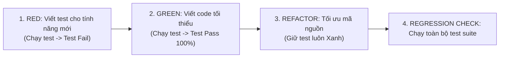

# 🤖 Skill: Test Automator — Tự Động Hóa Kiểm Thử & Kỹ Thuật Đảm Bảo Chất Lượng

## 🎯 Mục đích & Triết lý Kiểm Thử

Skill này cung cấp phương pháp luận và kỹ thuật tự động hóa kiểm thử phần mềm toàn diện, phối hợp chặt chẽ với agent **TesterPro** và tuân thủ tuyệt đối quy tắc **`TESTING.md`**.

### 3 Nguyên tắc Bất di bất dịch:
1. **Kiểm thử 3 Tầng Kịch bản Bắt buộc**:
   - **Happy Path**: Dữ liệu chuẩn mực, xử lý đúng luồng mong đợi.
   - **Edge Cases**: Giá trị biên (null, rỗng, số âm, số 0, chuỗi cực dài, danh sách rỗng, ngày tháng vượt ngưỡng).
   - **Error Handling**: Xử lý ngoại lệ chuẩn xác (mất kết nối, HTTP 401/403/500, token hết hạn, dữ liệu sai định dạng).
2. **Không Viết Test Hình Thức**: Mọi bài test phải có assertion rõ ràng, kiểm tra đúng trạng thái và dữ liệu đầu ra, cấm viết test rỗng hoặc assert vu vơ.
3. **Chu Trình Kiểm Thử Khép Kín (Debug Loop)**:
   - Viết code $\rightarrow$ Chạy test terminal (`flutter test` hoặc `dotnet test`).
   - Nếu FAIL: Đọc kỹ stack trace, **sửa file implementation (cấm sửa test để ép test xanh)**, chạy lại đến khi 100% PASS và 0 Warnings.

---

## 🏗️ Chiến Lược Kim Tự Tháp Kiểm Thử (Test Pyramid)

```
        / \
       /   \        E2E / Integration Tests (Flutter Driver, Web E2E)
      / ----\
     /       \      Component / Widget Tests (App* Widgets, Razor Views)
    / --------\
   /           \    Unit Tests (Services, Repositories, Use Cases, Models)
  /_____________\
```

### 1. Tầng Unit Test (Chân kim tự tháp — Nhanh, Độc lập, Bao phủ cao)
- **Flutter / Dart**:
  - Sử dụng `package:test` hoặc `flutter_test`.
  - Cô lập hoàn toàn phụ thuộc ngoại vi bằng mock (`mockito`, `fake`).
  - Kiểm thử logic xử lý nghiệp vụ của Bloc/Cubit/Provider, parse JSON model, các hàm tiện ích (`DateTime`, `NumberFormat`).
- **Backend C# (.NET Framework 4.8 / ASP.NET MVC 5)**:
  - Sử dụng NUnit hoặc MSTest kèm `Moq`.
  - Kiểm thử tầng Business Logic / Service: tính KPI, phê duyệt nghỉ phép, phân công công việc.
  - Mock repository interface (`IProjectRepository`, `IUserRepository`).

### 2. Tầng Widget / Component Test (Kiểm tra hiển thị & tương tác)
- **Flutter**:
  - Sử dụng `testWidgets` và `WidgetTester`.
  - Bơm mock dependencies qua InheritedWidget hoặc Provider.
  - Xác minh hiển thị đúng 5 trạng thái (Loading với `AppLoading`, Data, Empty, Error với `AppErrorState`, Offline).
  - Thử nghiệm thao tác người dùng: tap nút, nhập văn bản vào `AppTextField`, kéo cuộn danh sách, xác nhận dialog.
- **Web**:
  - Kiểm thử Controller Action trả về đúng `ViewResult`, `JsonResult`, `HttpStatusCodeResult`.
  - Xác thực ModelState validation logic.

### 3. Tầng Integration & API Test (Kiểm tra dòng chảy dữ liệu thực)
- Kiểm tra hợp đồng API (Contract Testing) giữa Flutter BrewTask và Web ASP.NET MVC.
- Xác thực Bearer Token, làm mới token (Refresh Token flow), xử lý lỗi phân quyền (401 Unauthorized, 403 Forbidden).

---

## 🔄 Quy Trình TDD Chuẩn (Red-Green-Refactor)



1. **Bước 1 — Viết Test Thất Bại (Red)**: Định nghĩa interface và các kịch bản mong đợi trước khi viết logic thực thi. Chạy test để đảm bảo bài test fail đúng lý do.
2. **Bước 2 — Viết Code Đạt Chuẩn (Green)**: Viết logic sạch sẽ, xử lý đủ trường hợp để bài test vượt qua.
3. **Bước 3 — Tối ưu Hóa (Refactor)**: Loại bỏ trùng lặp code, tách hàm nhỏ, đặt tên rõ ràng, đảm bảo tuân thủ quy tắc kiến trúc (Controller $\rightarrow$ Service $\rightarrow$ Repository).
4. **Bước 4 — Kiểm Tra Hồi Quy (Regression Check)**: Chạy lại toàn bộ test suite trong module để chắc chắn thay đổi không làm gãy các tính năng cũ.

---

## 🛠️ Lệnh Kiểm Thử Tự Động Trong Terminal

### Cho Flutter (Mobile BrewTask):
```bash
# Di chuyển vào thư mục mobile
cd Mobile-Flutter

# Chạy phân tích tĩnh mã nguồn (0 Errors, 0 Warnings)
flutter analyze

# Chạy toàn bộ unit & widget tests
flutter test

# Chạy một file test cụ thể
flutter test test/features/task_management/task_service_test.dart
```

### Cho Web ASP.NET MVC 5:
```powershell
# Chạy build kiểm tra cú pháp và compile
msbuild ProjectManager.sln /p:Configuration=Debug /t:Build

# Chạy unit test suite
dotnet test ProjectManager.Tests/ProjectManager.Tests.csproj
```

---

## 📋 Checklist Tự Động Hóa Kiểm Thử (Automator Checklist)

- [ ] Đã bao phủ trọn vẹn 3 tầng kịch bản: Happy Path, Edge Cases, Error Handling?
- [ ] Các phụ thuộc ngoại vi (Database, HTTP API, File) đã được Mock 100%?
- [ ] Không có bài test nào bị skip/ignore vô căn cứ?
- [ ] Đã chạy lệnh test thực tế trên terminal và kết quả **PASS 100%**?
- [ ] Đã chạy linter (`flutter analyze`) và đạt **0 Errors, 0 Warnings**?
- [ ] Không vi phạm giới hạn 3 lần thử: Nếu sau 3 lần sửa mà test vẫn fail, dừng lại báo cáo nguyên nhân gốc rễ (Root Cause Analysis).
