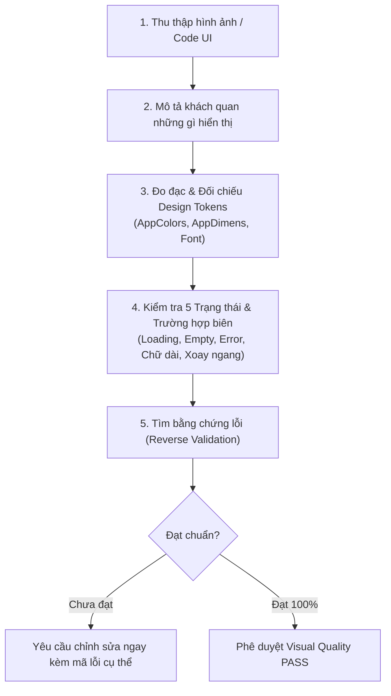

# 👁️ Skill: UI Visual Validator — Xác Thực & Kiểm Thử Giao Diện Trực Quan

## 🎯 Mục đích & Nguyên tắc Cốt lõi

Skill này đóng vai trò là **chuyên gia thẩm định trực quan khắt khe**, tập trung phát hiện các sai lệch hiển thị, lỗi visual regression, vỡ bố cục (overflow), lệch chuẩn Design System và vi phạm khả năng tiếp cận (a11y/WCAG) trên cả Web ASP.NET và Flutter Mobile (BrewTask).

### Nguyên tắc Vàng:
1. **Mặc định xem như CHƯA ĐẠT** cho đến khi có bằng chứng trực quan rõ ràng chứng minh đã đạt.
2. **Soi lỗi không khoan nhượng**: Tìm kiếm các điểm bất hợp lý, khoảng cách lệch 1-2px, màu sắc sai lệch bảng mã, phân cấp mờ nhạt.
3. **Đánh giá dựa trên bằng chứng hiển thị**: Không đoán mò dựa trên ý định trong code, phải căn cứ vào cách thành phần thực sự render trên màn hình.
4. **100% Tuân thủ Design System dự án**:
   - **Flutter (BrewTask)**: 100% dùng widget `App*`, bảng màu VS Code Dark Theme (`AppColors`), khoảng cách bội số 4 (`AppDimens`), touch target $\ge 48\text{dp}$.
   - **Web (ASP.NET)**: Giao diện bảng/form chuẩn, Hero Card, backdrop-blur modal, responsive mượt mà.

---

## 🔍 Năng Lực Kiểm Thử Trực Quan (Capabilities)

### 1. Phân tích Chi tiết Từng Pixel (Pixel-Perfect & Layout Inspection)
- **Kiểm tra vỡ bố cục / Tràn viền (Overflow)**:
  - Phát hiện triệt để lỗi `RenderFlex overflowed by X pixels` trên các kích thước màn hình nhỏ.
  - Kiểm tra chữ dài bị cắt cụt vô lý hoặc tràn ra ngoài card/container mà không có `TextOverflow.ellipsis` hoặc co dãn phù hợp.
  - Kiểm tra bàn phím ảo đẩy vỡ layout: Các form nhập liệu phải nằm trong `SingleChildScrollView` có đệm dưới an toàn.
- **Căn lề & Khoảng thở (Spacing & Alignment)**:
  - Soi mép trái/phải: Các phần tử cùng nhóm phải gióng thẳng hàng tuyệt đối.
  - Khoảng cách giữa các thành phần phải tuân thủ chuẩn bội số 4: 4, 8, 12, 16, 24, 32px (`AppDimens`). Bắt sửa ngay nếu thấy các số lẻ tùy hứng (7, 11, 13, 15, 19, 21px).

### 2. Kiểm Soát Bảng Màu & Visual Hierarchy
- **Bảng màu hệ thống (`AppColors`)**:
  - Phát hiện bất kỳ giá trị màu hard-code hex (`#FFFFFF`, `Color(0xFF...)`). Bắt buộc dùng `AppColors`.
  - Phối màu Dark Theme: Nền tối sâu (`AppColors.backgroundDark`), thẻ nổi bật vừa phải (`AppColors.cardDark`), viền phân cách mờ tinh tế (`AppColors.borderDark`), điểm nhấn thương hiệu (`AppColors.primary`).
  - Ngữ nghĩa màu sắc đồng nhất: Thành công (`AppColors.success`), Cảnh báo (`AppColors.warning`), Lỗi/Xóa (`AppColors.danger`).
- **Độ tương phản màu sắc (WCAG AA Contrast Ratio)**:
  - Tỷ lệ tương phản chữ trên nền tối thiểu **4.5:1** cho văn bản thường và **3:1** cho văn bản lớn ($\ge 18\text{pt}$ hoặc $\ge 14\text{pt}$ đậm).
  - Nghiêm cấm chữ xám mờ trên nền xám tối gây căng thẳng mắt cho người dùng.

### 3. Thẩm Tra 5 Trạng Thái Giao Diện (5 UI States)
Mọi màn hình tải dữ liệu hoặc danh sách bắt buộc phải được thiết kế và render chuẩn xác 5 trạng thái:
1. **Loading State**: Sử dụng `AppLoading` (ly cà phê bốc khói đặc trưng của BrewTask). **Tuyệt đối cấm** `CircularProgressIndicator` gốc.
2. **Data State**: Hiển thị dữ liệu trọn vẹn, phân cấp thông tin rõ ràng, dữ liệu số được format chuẩn (dấu chấm/phẩy tiếng Việt).
3. **Empty State**: Khi danh sách rỗng, phải có hình minh họa/icon trực quan, thông điệp hướng dẫn cụ thể và nút hành động kêu gọi (Call to Action).
4. **Error State**: Sử dụng `AppErrorState` với thông báo lỗi tiếng Việt thân thiện, rõ nguyên nhân và nút bấm "Thử lại".
5. **Offline State**: Trạng thái mất kết nối mạng hiển thị banner hoặc thông báo nhẹ nhàng, không crash hoặc kẹt màn hình trắng.

### 4. Vùng Bấm Cảm Ứng (Touch Target & Interactive Elements)
- Kích thước vùng bấm tối thiểu: **$48 \times 48\text{dp}$** đối với mọi nút bấm, icon button, checkbox, switch, filter chips.
- Khoảng cách an toàn giữa 2 vùng bấm cạnh nhau tối thiểu **8dp** để ngăn chặn bấm nhầm.
- Nút bấm khi nhấn vào phải có phản hồi thị giác (micro-interaction: ripple effect, đổi nhẹ sắc thái, hoặc loading spinner nội nút khi đang xử lý).

---

## 📋 Quy Trình Xác Thực Trực Quan 6 Bước (Visual Validation Workflow)

1. **Thu thập dữ liệu**: Đọc mã nguồn widget/view, ảnh chụp màn hình emulator, hoặc preview trình duyệt.
2. **Mô tả khách quan**: Liệt kê chính xác các thành phần đang hiển thị, phân cấp tiêu đề, nội dung, nút hành động.
3. **Đo đạc & Kiểm tra thông số**:
   - Khoảng cách padding/margin có thuộc bội số 4?
   - Cỡ chữ có theo thang chuẩn `AppTextStyles`?
   - Màu sắc có dùng token `AppColors`?
   - Touch target có đạt $\ge 48\text{dp}$?
4. **Kiểm tra 5 trạng thái & biên hiển thị**:
   - Khi dữ liệu trống sẽ trông ra sao?
   - Khi tên dự án dài 100 ký tự có bị vỡ dòng không?
   - Bàn phím mở lên có che mất nút xác nhận không?
5. **Kỹ thuật Phản biện Ngược (Reverse Validation)**:
   - Tự đặt câu hỏi: *"Giao diện này có thể bị xấu hoặc lỗi ở trường hợp nào?"*
   - Tìm kiếm các chi tiết cẩu thả: lệch 1px, icon không đều kích thước, viền bóng không đồng bộ.
6. **Kết luận & Báo cáo**:
   - Đưa ra kết luận rõ ràng: **ĐẠT** hoặc **KHÔNG ĐẠT**.
   - Nếu KHÔNG ĐẠT: Chỉ rõ dòng code/vị trí pixel lỗi và cung cấp đoạn code sửa chữa chuẩn xác.
