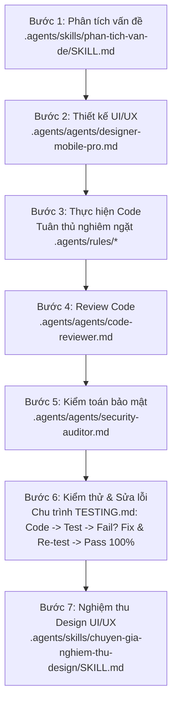

# Dự án: Hệ thống quản lý dự án & nhân sự — Tổ NCPT (web) + BrewTask (mobile)

Web ASP.NET MVC 5 (.NET Framework 4.8) + SQL Server quản lý dự án, nhân sự, giao việc, chấm KPI,
nghỉ phép của Tổ NCPT, kèm ứng dụng mobile Flutter (**BrewTask**, thư mục `Mobile-Flutter/`) gọi
thẳng API của web. Chi tiết chức năng xem `README.md` ở gốc dự án.

Các quy tắc trong `.agents/rules/` và quy trình workflow áp dụng **bắt buộc và tuyệt đối cho toàn bộ dự án**:

---

## 1. Ngôn ngữ giao tiếp & Hiển thị
- Luôn trả lời, viết tài liệu, comment, và mọi chuỗi hiển thị UI bằng **tiếng Việt có dấu chuẩn xác 100%**.

---

## 2. Quy tắc bắt buộc theo loại file (`.agents/rules/`)

| Đang sửa | Quy tắc áp dụng | Yêu cầu cốt lõi |
|---|---|---|
| **Kiểm thử & Linter** | `TESTING.md` | Sau khi sửa/viết logic, **LUÔN tự động chạy test trong terminal** (`flutter test`, `flutter analyze`). Nếu FAIL/Error $\rightarrow$ **tự động đọc log, sửa code và test lại đến khi PASS 100%** mới được báo cáo hoàn thành. |
| **Mọi file** | `CODING_RULES.md` | Giữ nguyên kiến trúc, không đổi business logic ngoài phạm vi yêu cầu, không rename namespace/class/project bừa, không đổi framework/phiên bản .NET, UTF-8 có BOM cho file `.cshtml`/`.cs`, không SELECT * tùy tiện. |
| **`.dart` (Flutter)** | `FLUTTER_RULES.md` | **CẤM DÙNG TRỰC TIẾP WIDGET GỐC FLUTTER**: Tuyệt đối không dùng `CircularProgressIndicator`, `TextField`, `TextFormField`, `Text`, `DropdownButton`, `Checkbox`, `FloatingActionButton`, `Card`, `ElevatedButton`. **BẮT BUỘC DÙNG 100% CUSTOM WIDGETS `App*`**: `AppLoading` (ly cà phê bốc khói), `AppTextField`, `AppDateField`, `AppRichEditor`, `AppText`, `AppDropdown`, `AppCheckbox`, `AppFab`, `AppCard`, `AppButton`, `AppErrorState`, `AppColors`, `AppDimens` (bội số 4, touch target ≥ 48dp). |
| **`.cs` / `.cshtml`** | `C_SHARP_RULES.md` | Naming convention chuẩn C#, luồng Controller → Service → Repository, không viết SQL/business trong Controller, method Async có hậu tố `Async`. |
| **`.sql` / Query** | `SQL_SERVER_RULES.md` | Không `SELECT *`, luôn tham số hóa (không nối chuỗi), `DELETE`/`UPDATE` luôn có `WHERE`, transaction cho nhiều update, `NVARCHAR`/`N'...'` cho dữ liệu tiếng Việt. |

---

## 3. Workflow 7 bước bắt buộc khi xử lý vấn đề & xây dựng tính năng

Mọi vấn đề, tính năng mới hoặc sửa lỗi **BẮT BUỘC** phải tuân theo luồng 7 bước sau:

1. **Bước 1 — Phân tích vấn đề**: Sử dụng `.agents/skills/phan-tich-van-de/SKILL.md` để phân tích sâu bài toán, đặt câu hỏi làm rõ và ghi `Memory.md`.
2. **Bước 2 — Thiết kế UI/UX**: Sử dụng `.agents/agents/designer-mobile-pro.md` để thiết kế layout, visual hierarchy, màu sắc `AppColors`, khoảng cách `AppDimens`, chuẩn bị 5 trạng thái giao diện.
3. **Bước 3 — Thực hiện Code**: Viết code chuẩn xác theo `.agents/rules/` (Controller → Service → Repository cho C#, 100% custom widgets `App*` cho Flutter).
4. **Bước 4 — Review Code**: Sử dụng `.agents/agents/code-reviewer.md` để review kiến trúc, chất lượng mã nguồn, khắc phục cảnh báo và tối ưu code.
5. **Bước 5 — Kiểm toán bảo mật**: Sử dụng `.agents/agents/security-auditor.md` để rà soát an toàn thông tin, quyền truy cập, token, SQLi, XSS.
6. **Bước 6 — Kiểm thử, Soi Lỗi Toàn diện & Tự Sửa Lỗi (Auto-Fix)**: Sử dụng `.agents/agents/TesterPro.md`, `.agents/rules/TESTING.md` và `.agents/agents/test-engineer.md`. Agent `TesterPro` tự động soi toàn diện (UI/UX, code ẩu, lỗi font tiếng Việt, vi phạm Rules, lệch chuẩn Design System), **TỰ ĐỘNG SỬA MÃ NGUỒN NGAY (Auto-Fix)** và chạy `flutter test`, `flutter analyze` (đảm bảo 0 Errors, 0 Warnings, Pass 100%).
7. **Bước 7 — Nghiệm thu Design UI/UX**: Sử dụng `.agents/skills/chuyen-gia-nghiem-thu-design/SKILL.md` để tự nghiệm thu khắt khe 7 tiêu chí thiết kế.

---

## 4. Quy trình Đẩy code (Chỉ thực hiện khi người dùng yêu cầu)
- **CHỈ KHI NÀO** người dùng gõ lệnh "Đẩy code", "push code", "up code", "merge code" thì mới dùng `.agents/skills/git-push-merge/SKILL.md` (nhánh hiện tại → `main` → `upload-source`).

---

## 5. Điều CẤM TUYỆT ĐỐI
- Cấm tự ý dùng `CircularProgressIndicator` (phải dùng `AppLoading`).
- Cấm tự ý sửa đổi code để ép test xanh mà vi phạm nghiệp vụ.
- Cấm tự ý đẩy code khi người dùng chưa yêu cầu "Đẩy code".
- Cấm push code thiếu bước lên `upload-source`.
- Cấm hard-code màu sắc hex hoặc số lẻ khoảng cách (phải dùng `AppColors` và `AppDimens`).
- Cấm bỏ qua quy trình workflow (nhảy cóc bước phân tích, review, bảo mật, test hoặc nghiệm thu).
- Cấm báo cáo hoàn thành khi test chưa Pass 100% hoặc còn lỗi linter/compile.
