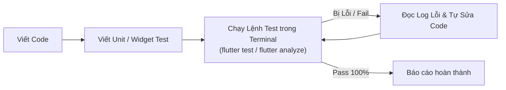
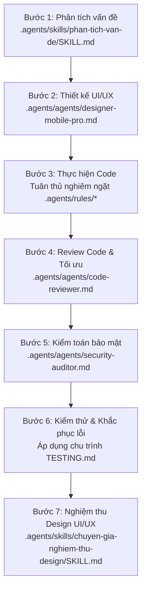

# Rules Bắt Buộc & Workflow Phát Triển — ProjectManager & BrewTask

Hệ thống quản lý dự án & nhân sự Tổ NCPT (ASP.NET MVC 5 + SQL Server) và ứng dụng di động Flutter (**BrewTask**).
Mọi tương tác, phân tích, lập trình, kiểm thử và phản hồi **BẮT BUỘC** tuân thủ các quy tắc trong `.agents/rules/` và quy trình workflow bên dưới.

---

## I. QUY TẮC CỐT LÕI (BẮT BUỘC 100%)

1. **Ngôn ngữ giao tiếp & Hiển thị**:
   - 100% tiếng Việt có dấu chuẩn xác trong giao tiếp, tài liệu, comment và mọi chuỗi hiển thị UI.

2. **Tuân thủ quy tắc theo loại file (`.agents/rules/`)**:
   - **Quy tắc Kiểm thử & Xác minh (`TESTING.md`)**:
     - Sau khi tạo mới hoặc chỉnh sửa bất kỳ logic code nào, **LUÔN PHẢI tự động chạy bộ test tương ứng qua terminal** (`flutter test`, `flutter analyze`, hoặc MSBuild).
     - Nếu test thất bại (FAIL) hoặc gặp lỗi compile/linter, **tự động đọc log lỗi, sửa code và chạy lại test**.
     - **Chỉ xem nhiệm vụ hoàn thành khi toàn bộ test đã vượt qua (PASS 100%) và không còn lỗi linting/compile**.
   - **Toàn bộ dự án (`CODING_RULES.md`)**: Giữ nguyên kiến trúc hiện tại, không tự ý thay đổi business logic ngoài phạm vi yêu cầu, file `.cshtml`/`.cs` luôn lưu UTF-8 có BOM.
   - **Flutter Mobile (`FLUTTER_RULES.md`)**:
     - **CẤM DÙNG TRỰC TIẾP WIDGET GỐC FLUTTER**: Tuyệt đối không dùng `CircularProgressIndicator`, `TextField`, `TextFormField`, `Text`, `Checkbox`, `DropdownButton`, `FloatingActionButton`, `Card`, `ElevatedButton`.
     - **BẮT BUỘC DÙNG 100% CUSTOM WIDGETS `App*`**: `AppLoading` (ly cà phê bốc khói), `AppTextField`, `AppDateField`, `AppRichEditor`, `AppText`, `AppDropdown`, `AppCheckbox`, `AppFab`, `AppCard`, `AppButton`, `AppErrorState`.
     - **Màu sắc & Kích thước**: 100% dùng `AppColors` và `AppDimens` (khoảng cách bội số 4, touch target ≥ 48dp).
   - **Backend C# (`C_SHARP_RULES.md`)**: Luồng Controller → Service → Repository, method Async có hậu tố `Async`, không viết business/SQL trong Controller.
   - **Cơ sở dữ liệu (`SQL_SERVER_RULES.md`)**: Không `SELECT *`, luôn tham số hóa SqlCommand, `UPDATE`/`DELETE` luôn có `WHERE`, dùng `NVARCHAR`/`N'...'` cho tiếng Việt.

---

## II. CHU TRÌNH HOẠT ĐỘNG VÀ KIỂM THỬ (TESTING LOOP)

Mọi thay đổi code logic phải tuân thủ nghiêm ngặt chu trình tự động kiểm thử và sửa lỗi khép kín sau:

> [!IMPORTANT]
> - **Tuyệt đối không dừng lại hoặc báo cáo hoàn thành khi test vẫn đang FAIL.**
> - **Cấm sửa đổi logic test một cách tùy tiện để ép test pass mà vi phạm nghiệp vụ.**

---

## III. WORKFLOW 7 BƯỚC BẮT BUỘC KHI XỬ LÝ VẤN ĐỀ & XÂY DỰNG CHỨC NĂNG

Mỗi khi tiếp nhận một bài toán, yêu cầu mới, tính năng mới hoặc xử lý lỗi, **BẮT BUỘC** thực hiện tuần tự theo luồng 7 bước sau:

### 1. Bước 1 — Phân tích vấn đề (`.agents/skills/phan-tich-van-de/SKILL.md`)
- Phân tích bối cảnh, mục tiêu sâu xa, phạm vi (in/out-scope), các bên liên quan, ràng buộc kỹ thuật và rủi ro.
- Đặt câu hỏi làm rõ (nếu có điểm chưa rõ) và ghi chép đầy đủ vào `Memory.md`.

### 2. Bước 2 — Thiết kế UI/UX (`.agents/agents/designer-mobile-pro.md`)
- Định hình layout, phân cấp thị giác (visual hierarchy), bảng màu chuẩn VS Code Dark Theme (`AppColors`), khoảng cách chuẩn (`AppDimens`).
- Thiết kế đầy đủ 5 trạng thái màn hình: *Loading (ly cà phê bốc khói)*, *Data (dữ liệu)*, *Empty (dữ liệu rỗng)*, *Error (báo lỗi kèm nút thử lại)*, *Offline/No Connection*.

### 3. Bước 3 — Thực hiện Code (Tuân thủ nghiêm ngặt `.agents/rules/`)
- Triển khai code chuẩn xác theo kiến trúc dự án.
- Sử dụng 100% custom widgets `App*`, đảm bảo touch target ≥ 48dp, không hard-code màu sắc hay khoảng cách.

### 4. Bước 4 — Review Code & Tối ưu (`.agents/agents/code-reviewer.md`)
- Rà soát toàn bộ mã nguồn vừa viết: kiến trúc phân lớp, đặt tên chuẩn C#/Dart, xử lý ngoại lệ, memory leak, linter warnings (`flutter analyze`).
- Tối ưu hóa và sửa ngay các điểm chưa đạt.

### 5. Bước 5 — Kiểm toán bảo mật (`.agents/agents/security-auditor.md`)
- Rà soát an toàn thông tin: SQL Injection, XSS, Broken Access Control, xác thực Bearer Token, bảo mật dữ liệu nhạy cảm, lộ thông tin cá nhân.
- Khắc phục triệt để mọi rủi ro an ninh mạng trước khi chuyển sang bước kiểm thử.

### 6. Bước 6 — Kiểm thử & Khắc phục lỗi (`.agents/rules/TESTING.md` & `.agents/agents/test-engineer.md`)
- Viết/cập nhật unit test và widget test bao phủ các luồng chính và edge cases.
- **Tự động chạy `flutter test` và `flutter analyze`** (hoặc MSBuild cho Web C#).
- Nếu phát sinh lỗi: Đọc log lỗi chi tiết, sửa code và chạy lại test liên tục cho đến khi **100% PASS và 0 Errors, 0 Warnings**.
- Kiểm tra trực quan trên Emulator / Trình duyệt.

### 7. Bước 7 — Nghiệm thu Design UI/UX (`.agents/skills/chuyen-gia-nghiem-thu-design/SKILL.md`)
- Đóng vai chuyên gia khó tính, tự nghiệm thu theo 7 tiêu chí khắt khe: WCAG AA Contrast, Typography, Spacing bội số 4, Touch target ≥ 48dp, 100% Custom widgets `App*`, 5 trạng thái giao diện, tính thẩm mỹ & chuyên nghiệp.
- Nếu KHÔNG ĐẠT tiêu chí nào, bắt buộc phải chỉnh sửa lại ngay.

---

## IV. QUY TRÌNH ĐẨY CODE (CHỈ THỰC HIỆN KHI NGƯỜI DÙNG YÊU CẦU)

> [!IMPORTANT]
> **Không tự ý đẩy code sau mỗi lần hoàn thành bước 7**. Chỉ khi nào người dùng gõ lệnh **"Đẩy code"**, **"push code"**, **"up code"**, **"merge code"** hoặc các câu lệnh tương đương thì mới thực hiện đẩy code theo quy trình chuẩn Git của `.agents/skills/git-push-merge/SKILL.md`:
>
> 1. Commit thay đổi trên nhánh hiện tại (`mobile` / `feature`).
> 2. Push nhánh hiện tại lên `origin`.
> 3. Checkout `main` → Pull `main` → Merge nhánh hiện tại vào `main` → Push `main`.
> 4. Checkout `upload-source` → Pull `upload-source` → Merge `main` vào `upload-source` → Push `upload-source`.
> 5. Checkout về lại nhánh ban đầu.
